# Cloudflare Solutions Engineer – Technical Project

## Pre-requisite:

> 1. Please add a domain (new or existing, e.g. yourwebsite.com) to Cloudflare.
>    Cloudflare Free plan is sufficient.
> 2. Activate on Cloudflare by following the steps to change the nameservers at
>    your DNS Registrar.

Bought a domain on Cloudflare "wilson-here.uk".

## Step 1

> Create an origin web server on a platform of your choosing. This could be in
> AWS, Google Cloud, DigitalOcean, your Raspberry Pi, etc.
>
> This web server must run an endpoint that returns all HTTP request headers in
> the body of the HTTP response.
>
> The web server can be something that you have written yourself (e.g. in
> JavaScript, Python, etc) or by using a 3rd party application.

- Deployed an EC2 using Terraform.
- Ran a NodeJS http server.

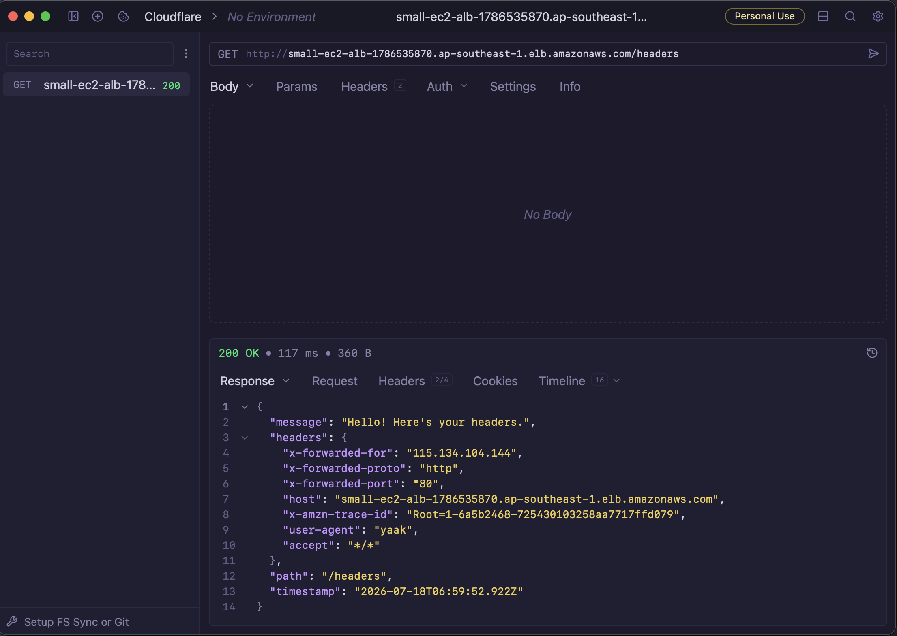

## Step 2

> Proxy traffic to this server through Cloudflare. Add necessary configurations
> on Cloudflare.

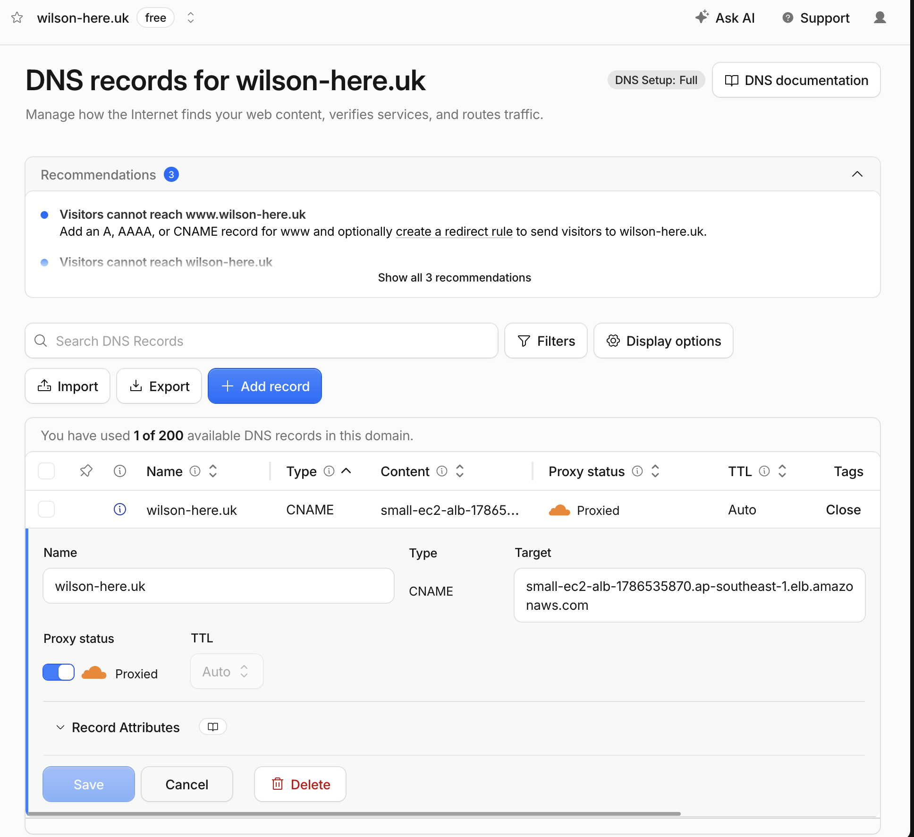

Default TLS mode was Full. However HTTPS connection won't work due to no
certificate set up on ALB.

## Step 3

> Secure the communication between Cloudflare and your Origin Server with a
> non-Cloudflare provisioned TLS certificate using at least the Full-Strict mode
> on Cloudflare

Public cert was setup with wildcard (*.wilson-here.uk) using ACM on AWS and
attached to ALB.

After changing SSL/TLS encryption on Cloudflare to Full(Strict), the https
request was hit with `Error 526: invalid SSL certificate`.

And this issue

```sh
curl -v https://app.wilson-here.uk/headers

* Could not resolve host: app.wilson-here.uk
* Closing connection
curl: (6) Could not resolve host: app.wilson-here.uk
```

Resolved by flushing local DNS cache.

```sh
sudo dscacheutil -flushcache; sudo killall -HUP mDNSResponder
```

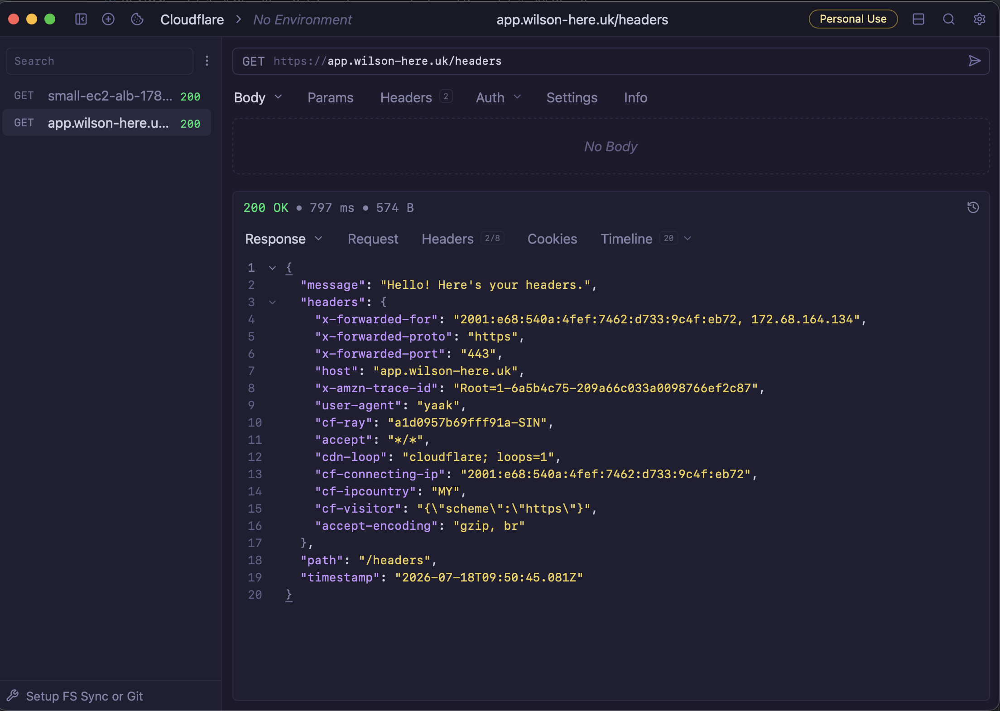

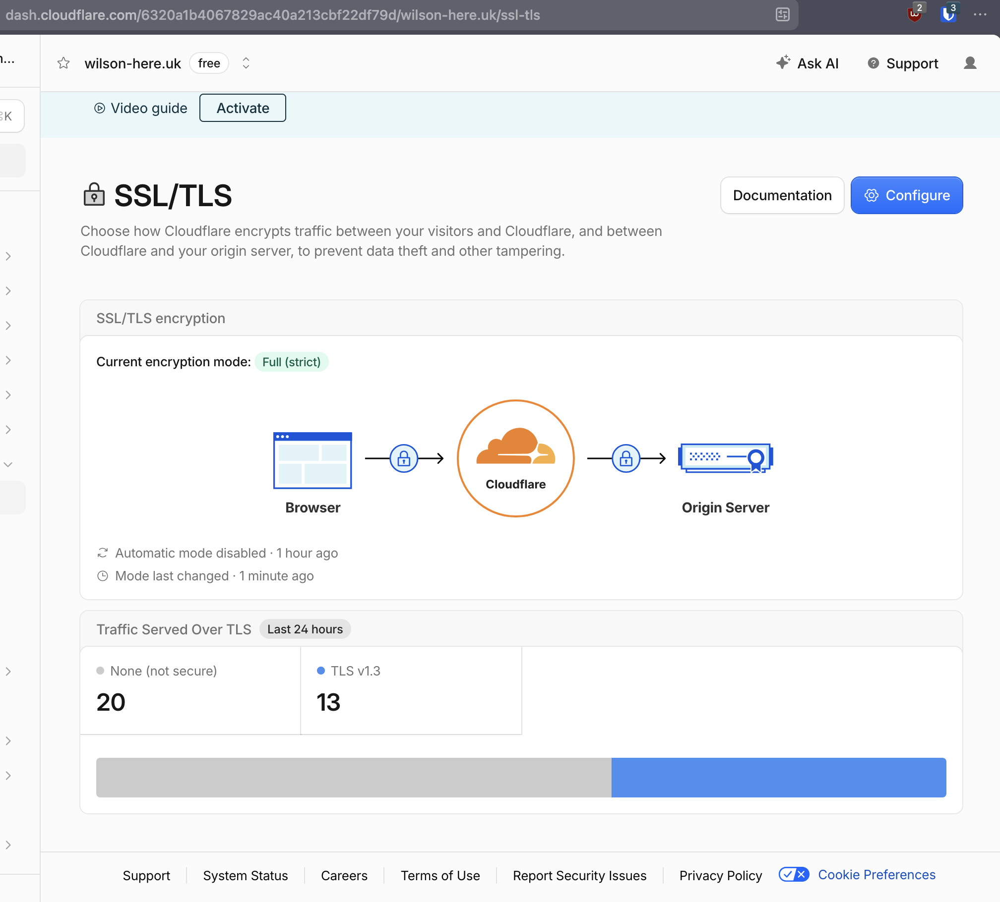

## Step 4

> Set a rate limiting rule on Cloudflare. How would you demonstrate to a
> customer that this rate limiting rule works?

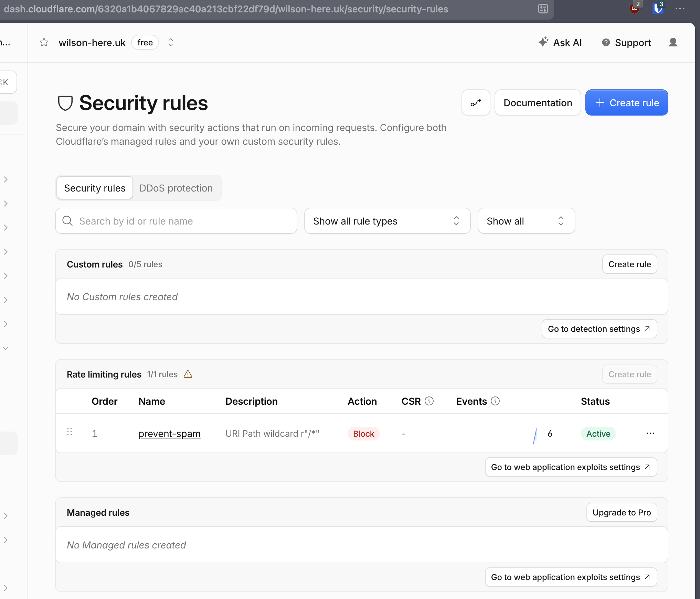

```sh
hurl -v test_rate_limiting.hurl
* ------------------------------------------------------------------------------
* Executing entry 1
*
* Entry options:
* delay: 1s
* repeat: 3
*
* Delay entry 1 (pause 1000 ms)
*
* Cookie store:
*
* Request:
* GET https://app.wilson-here.uk/headers
*
* Request can be run with the following curl command:
* curl 'https://app.wilson-here.uk/headers'
*
> GET /headers HTTP/2
> Host: app.wilson-here.uk
> Accept: */*
> User-Agent: hurl/8.0.1
>
* Response: (received 580 bytes in 312 ms)
*
< HTTP/2 200
< date: Sat, 18 Jul 2026 10:25:01 GMT
< content-type: application/json
< cf-cache-status: DYNAMIC
< nel: {"report_to":"cf-nel","success_fraction":0.0,"max_age":604800}
< report-to: {"group":"cf-nel","max_age":604800,"endpoints":[{"url":"https://a.nel.cloudflare.com/report/v4?s=fvtpjvEJyJOLx5CbFQ%2Bboth%2BtzKVO2u9%2Ft40lild4ISVI2BZLjNBYytaSO%2FrY%2B3U3V9HW5HSNOQSh2zg5JEvJ%2FdWEP7%2FIDScQG77Fmgc3JIq3itMm8DHuGeBzIH652QlMi97SiKEnR%2BUPz3cx4%2BYt5U%3D"}]}
< server: cloudflare
< cf-ray: a1d0c7aeec1ed4de-SIN
< alt-svc: h3=":443"; ma=86400
<
*
* Repeat entry 1 (x1/3)
* ------------------------------------------------------------------------------
* Executing entry 1
*
* Entry options:
* delay: 1s
* repeat: 3
*
* Delay entry 1 (pause 1000 ms)
*
* Cookie store:
*
* Request:
* GET https://app.wilson-here.uk/headers
*
* Request can be run with the following curl command:
* curl 'https://app.wilson-here.uk/headers'
*
> GET /headers HTTP/2
> Host: app.wilson-here.uk
> Accept: */*
> User-Agent: hurl/8.0.1
>
* Response: (received 17 bytes in 69 ms)
*
< HTTP/2 429
< date: Sat, 18 Jul 2026 10:25:02 GMT
< content-type: text/plain; charset=UTF-8
< content-length: 17
< retry-after: 10
< cache-control: private, max-age=0, no-store, no-cache, must-revalidate, post-check=0, pre-check=0
< expires: Thu, 01 Jan 1970 00:00:01 GMT
< referrer-policy: same-origin
< x-frame-options: SAMEORIGIN
< report-to: {"group":"cf-nel","max_age":604800,"endpoints":[{"url":"https://a.nel.cloudflare.com/report/v4?s=JMekU5PKHk8gYp03vhODGj8gOcXHDVvGKVsBEGWfxgxu2%2BpKvA1PNBuDl5AgeTokcdJO01I92ztL%2BuFgl5HCvI%2BzUEfKf8yOx%2F5bfUoFSKpV%2Fd%2BMjyyo1GxH4oYspGGeg%2Bp04z2D1Xu3uc7RIUjV5Ds%3D"}]}
< nel: {"report_to":"cf-nel","success_fraction":0.0,"max_age":604800}
< server: cloudflare
< cf-ray: a1d0c7b60b48d4de-SIN
< alt-svc: h3=":443"; ma=86400
<
*
* Repeat entry 1 (x2/3)
* ------------------------------------------------------------------------------
* Executing entry 1
*
* Entry options:
* delay: 1s
* repeat: 3
*
* Delay entry 1 (pause 1000 ms)
*
* Cookie store:
*
* Request:
* GET https://app.wilson-here.uk/headers
*
* Request can be run with the following curl command:
* curl 'https://app.wilson-here.uk/headers'
*
> GET /headers HTTP/2
> Host: app.wilson-here.uk
> Accept: */*
> User-Agent: hurl/8.0.1
>
* Response: (received 17 bytes in 57 ms)
*
< HTTP/2 429
< date: Sat, 18 Jul 2026 10:25:03 GMT
< content-type: text/plain; charset=UTF-8
< content-length: 17
< retry-after: 9
< cache-control: private, max-age=0, no-store, no-cache, must-revalidate, post-check=0, pre-check=0
< expires: Thu, 01 Jan 1970 00:00:01 GMT
< referrer-policy: same-origin
< x-frame-options: SAMEORIGIN
< report-to: {"group":"cf-nel","max_age":604800,"endpoints":[{"url":"https://a.nel.cloudflare.com/report/v4?s=kRIl1nlfhU61smEO2K5csNtzf5ZEdcE3mRUcGfi4Oo7ZmsM7G2mmYrNoekdNsPmjo5TqtvxDeLcdJ2Xf5pKR%2FPtb%2BkIgC1HvVDUSjY4vy3mJbg72yiwWnMlVjXjh3jLPHyXlLu%2B%2Fhsyp7Op6fqB3E%2Bg%3D"}]}
< nel: {"report_to":"cf-nel","success_fraction":0.0,"max_age":604800}
< server: cloudflare
< cf-ray: a1d0c7bcb97fd4de-SIN
< alt-svc: h3=":443"; ma=86400
<
*
error code: 1015
```

## Step 5

> Install and configure Cloudflare Tunnel on your origin server using a
> subdomain called “tunnel”, e.g. tunnel.yourwebsite.com. Make connections
> proxied to your server protected using this tunnel.

Followed instructions from this page:
https://developers.cloudflare.com/tunnel/deployment-guides/aws/#2-create-a-tunnel

To secure the AWS EC2, for the Security Group rules, only allow inbound traffic
for port 22 (SSH) and TCP from AWS ALB and allow only outbound traffic to the
Cloudflare Tunnel IP addresses. All Security Group rules are Allow rules;
traffic that does not match a rule is blocked. Therefore, you can delete all
inbound rules and leave only the relevant outbound rules.

## Step 8 (Did this before Step 6 & 7)

### Setup a worker returning HTML with partial required info

Followed instructions here:

- https://developers.cloudflare.com/workers/wrangler/commands/workers/
- https://developers.cloudflare.com/workers/wrangler/configuration/
- https://developers.cloudflare.com/workers/configuration/routing/routes/
- https://claytonerrington.com/blog/using-cloud-flare-workers-to-get-visitor-information/

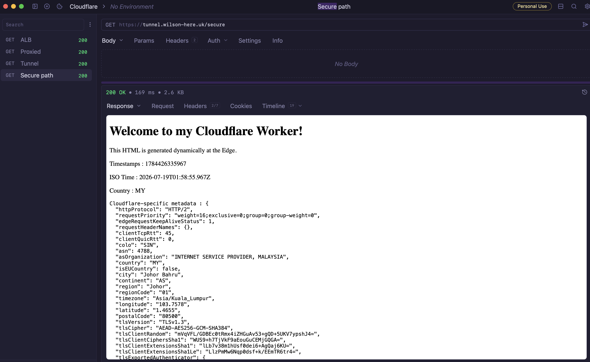

### Set up R2 bucket, upload flags, display svg

- https://developers.cloudflare.com/workers/tutorials/upload-assets-with-r2/
- https://flagicons.lipis.dev/

```sh
# Needs to enable R2 on the Cloudflare Dashboard
npx wrangler r2 bucket create country-flag-bucket
c
npx wrangler r2 bucket list

npx wrangler r2 object put country-flag-bucket/my.svg --file=../assets/flags-4x3/my.svg --remote
```

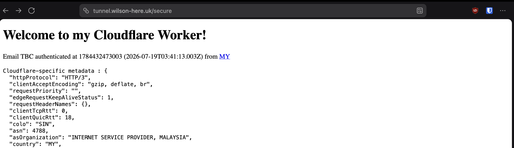

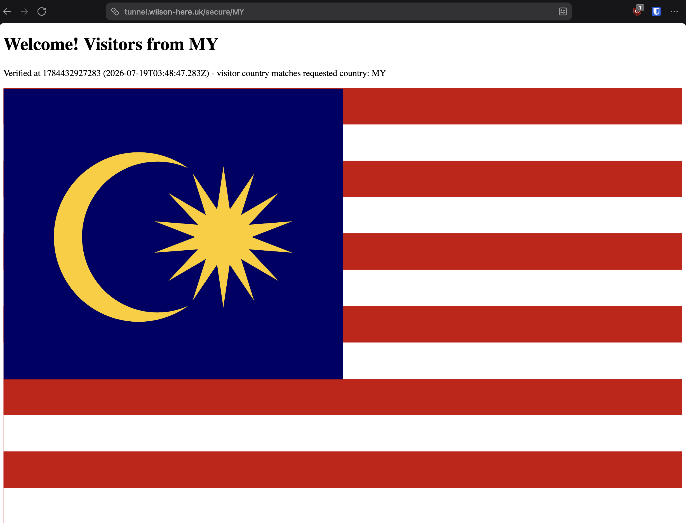

## Step 6

> Configure an SSO IdP (Identity Provider) of your choosing within Cloudflare
> Zero Trust. Please note that Cloudflare also provides an “OTP” option, in case
> you do not have any IdPs available to configure.

## Step 7

> Lock down access for a particular path for your Cloudflare Tunnel subdomain
> (e.g. tunnel.yourwebsite.com/secure) and only allow access for yourself (with
> the previously configured IdP of your choosing) and users with an
> @cloudflare.com email address .\
> a. Ensure nobody can bypass Cloudflare and access your server’s IP directly.

- https://developers.cloudflare.com/cloudflare-one/integrations/identity-providers/one-time-pin/

### Configured Cloudflare OTP and IdP and Secured Path

Path: tunnel.wilson-here.uk/secure

(which includes tunnel.wilson-here.uk/secure/{country})

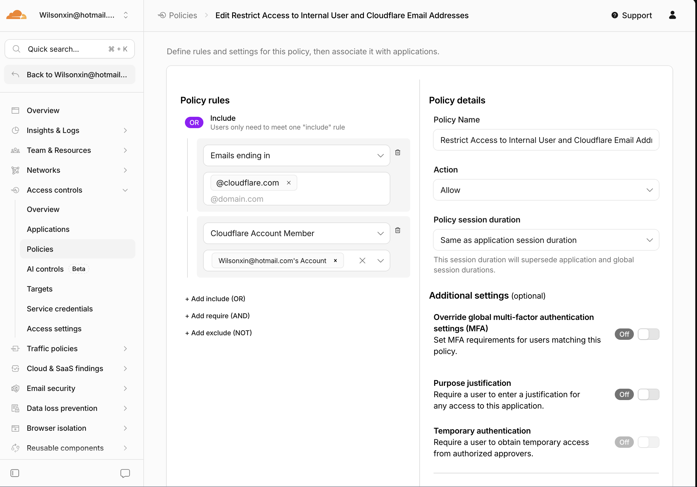

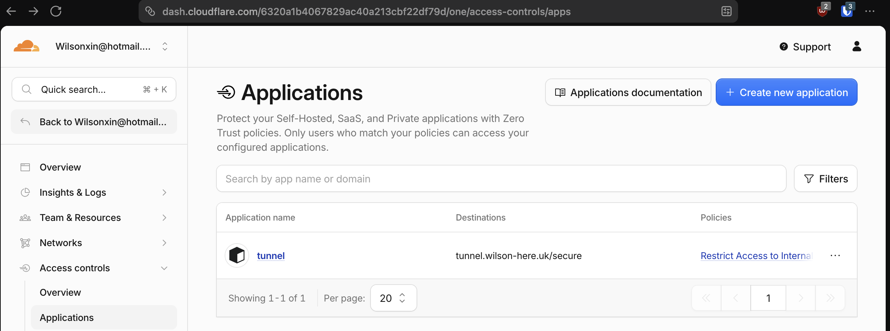

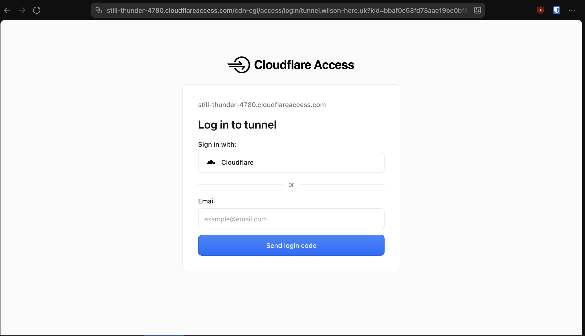
