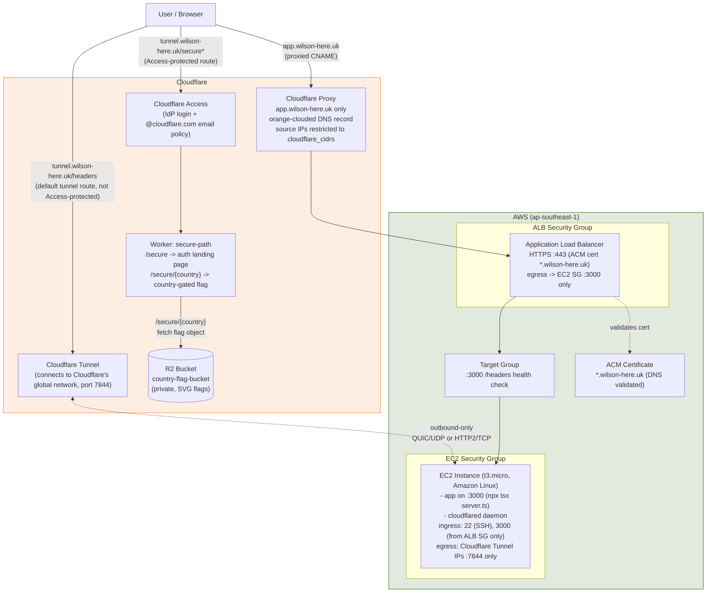

```mermaid
graph TB
    User["User / Browser"]

    subgraph CF["Cloudflare"]
        direction TB
        Access["Cloudflare Access\n(IdP login + @cloudflare.com email policy)"]
        Tunnel["Cloudflare Tunnel\n(connects to Cloudflare's global network, port 7844)"]
        Worker["Worker: secure-path\n/secure -> auth landing page\n/secure/{country} -> country-gated flag"]
        R2[("R2 Bucket\ncountry-flag-bucket\n(private, SVG flags)")]
        Edge["Cloudflare Proxy\napp.wilson-here.uk only\norange-clouded DNS record\nsource IPs restricted to cloudflare_cidrs"]
    end

    subgraph AWS["AWS (ap-southeast-1)"]
        direction TB

        subgraph ALBSG["ALB Security Group"]
            ALB["Application Load Balancer\nHTTPS :443 (ACM cert *.wilson-here.uk)\negress -> EC2 SG :3000 only"]
        end

        TG["Target Group\n:3000 /headers health check"]

        subgraph EC2SG["EC2 Security Group"]
            EC2["EC2 Instance (t3.micro, Amazon Linux)\n- app on :3000 (npx tsx server.ts)\n- cloudflared daemon\ningress: 22 (SSH), 3000 (from ALB SG only)\negress: Cloudflare Tunnel IPs :7844 only"]
        end

        ACM["ACM Certificate\n*.wilson-here.uk (DNS validated)"]
    end

    User -->|"tunnel.wilson-here.uk/secure*\n(Access-protected route)"| Access
    Access --> Worker
    Worker -->|"/secure/{country}\nfetch flag object"| R2

    User -->|"tunnel.wilson-here.uk/headers\n(default tunnel route, not Access-protected)"| Tunnel
    Tunnel <-.->|"outbound-only\nQUIC/UDP or HTTP2/TCP"| EC2

    User -->|"app.wilson-here.uk\n(proxied CNAME)"| Edge
    Edge --> ALB
    ALB -.->|validates cert| ACM
    ALB --> TG
    TG --> EC2

    style CF fill:#f4811e22,stroke:#f4811e
    style AWS fill:#25610022,stroke:#256100
```
